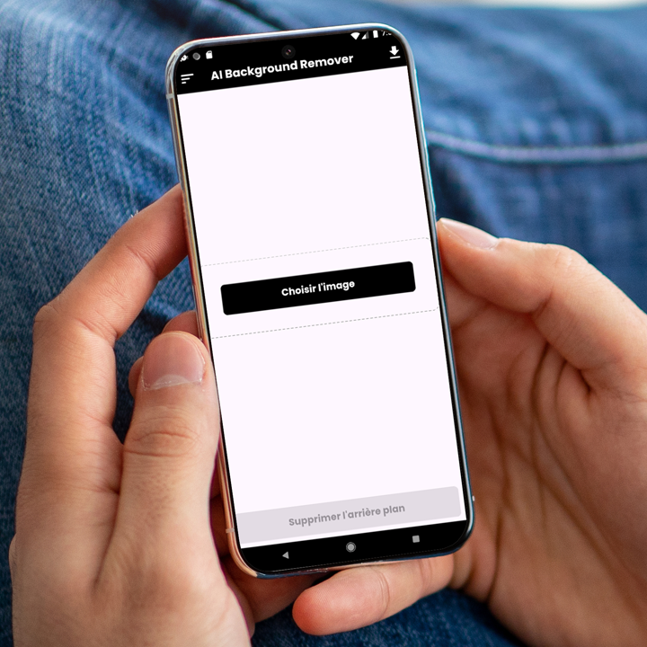

# AI Background Remover

**AI Background Remover** est une application Flutter qui permet de supprimer facilement l'arrière-plan des images à l'aide de techniques d'intelligence artificielle. L'application propose une interface utilisateur intuitive avec des fonctionnalités avancées pour un traitement rapide et précis des images.


## Fonctionnalités

- **Sélection d'image** : Permet de sélectionner une image de la galerie ou de prendre une photo via l'appareil photo.
- **Suppression d'arrière-plan** : Supprime automatiquement l'arrière-plan en utilisant une IA puissante.
- **Téléchargement** : Téléchargez l'image modifiée avec un arrière-plan transparent.
- **Interface utilisateur intuitive** : Un design propre et simple, accessible à tous.

## Captures d'écran

Ajoute des captures d'écran pour illustrer les fonctionnalités de ton application.

| Écran de sélection d'image | Suppression d'arrière-plan | Résultat final |
|---------------------------|----------------------------|----------------|
|  |  |  |

## Installation

Suivez les étapes ci-dessous pour configurer et exécuter ce projet localement.

### Prérequis

- Flutter SDK (Version recommandée : 2.0+)
- Android Studio ou VSCode avec Flutter installé
- Un émulateur Android ou un appareil physique pour les tests

### Étapes d'installation

1. Clonez le dépôt :
    ```bash
    git clone https://github.com/votre_nom_de_utilisateur/AI-Background-Remover.git
    ```

2. Accédez au répertoire du projet :
    ```bash
    cd AI-Background-Remover
    ```

3. Installez les dépendances :
    ```bash
    flutter pub get
    ```

4. Exécutez l'application :
    ```bash
    flutter run
    ```

### Problèmes potentiels

Si vous rencontrez des erreurs comme :

ADB exited with exit code 1 android.os.ParcelableException: java.io.IOException: Requested internal only, but not enough space..
Assurez-vous que l'appareil ou l'émulateur a suffisamment d'espace de stockage.


## Technologies utilisées

- **Flutter** : Framework mobile pour Android et iOS.
- **Dart** : Langage de programmation utilisé par Flutter.
- **remove.bg** : Pour la suppression d'arrière-plan.

## Contribution

Les contributions sont les bienvenues ! Si vous souhaitez apporter des améliorations ou ajouter des fonctionnalités, veuillez suivre les étapes suivantes :

1. Fork le projet
2. Créez une branche pour votre fonctionnalité (`git checkout -b feature/AmazingFeature`)
3. Commitez vos modifications (`git commit -m 'Add some AmazingFeature'`)
4. Poussez à la branche (`git push origin feature/AmazingFeature`)
5. Ouvrez une Pull Request


## Auteurs

- **[Etounde Philemon](https://github.com/Philemon011)** - Développeur principal
